# 🏆Platinum Frontend Structure🏆
# Index
- [📁 Main project structure](#-main-project-structure)
- [🌷 1. Models](#-1-models)
   * [🤵 1.1. User model](#-11-user-model)
   * [🎮 1.2. Game model](#-12-game-model)
   * [💎 1.3. Achievement model](#-13-achievement-model)
- [🍀 2. Components](#-2-components)
   * [🔒 2.1. **Auth component**](#-21-auth-component)
      + [- 📒 2.1.1. Register](#---211-register)
      + [- 🔑 2.1.2. Login](#---212-login)
   * [👑 2.2. **Pages**](#-22-pages)
      + [- 🏠 2.2.1. **Home**](#---221-home)
      + [- 👾 2.2.2. **Game**](#---222-game)
      + [- 🔎👾 2.2.3. **Games browse**](#---223-games-browse)
      + [- 👤 2.2.4. **Account**](#---224-account)
      + [- 🔎👤 2.2.5. **Users browse**](#---225-users-browse)
      + [- 👲 2.2.6. **Foreign user**](#---226-foreign-user)
   * [🫂 2.3. **Common**](#-23-common)
   * [⚓ 2.4. **Layout**](#-24-layout)
      + [- ⛵ 2.4.1. **Navbar**](#---241-navbar)
      + [- 👞 2.4.2. **Footer**](#---242-footer)
- [🍂 3. Services](#-3-services)
   * [🔏 3.1. **Auth service**](#-31-auth-service)
   * [💻 3.2. **Game service**](#-32-game-service)
   * [👮 3.3. **User service**](#-33-user-service)
   * [🏪 3.4. **Stores**](#-34-stores)
- [🍁 4. Interceptors](#-4-interceptors)
   * [🔓 4.1. **Auth interceptor**](#-41-auth-interceptor)
   * [💾 4.2. **Cache interceptor**](#-42-cache-interceptor)
- [🌵 5. Guards](#-5-guards)
   * [✋ 5.1. Auth Guard](#-51-auth-guard)
- [🌴 *EXTRA* Additional features ](#-extra-additional-features)
   * [♾️ Infinite scroll](#️-infinite-scroll)
   * [⛓️ Steam Account Linking](#️-steam-account-linking)
   * [🔍 Search input](#-search-input)


# 📁 Main project structure

```text
frontend/
├── node_modules/              
├── src/
│    ├───app
│    │   ├───components
│    │   │   ├───auth
│    │   │   │   ├───login
│    │   │   │   │   ├───login-component
│    │   │   │   │   └───login-form
│    │   │   │   └───register
│    │   │   │       ├───register-component
│    │   │   │       └───register-form
│    │   │   ├───common
│    │   │   │   ├───achievement-card-listed
│    │   │   │   ├───game-card
│    │   │   │   ├───game-card-listed
│    │   │   │   └───user-card
│    │   │   ├───layout
│    │   │   │   ├───footer
│    │   │   │   └───navbar
│    │   │   └───pages
│    │   │       ├───account
│    │   │       │   ├───account-banner
│    │   │       │   ├───account-component
│    │   │       │   ├───account-friends-list
│    │   │       │   ├───account-games-list
│    │   │       │   └───account-tabs
│    │   │       ├───foreign-user
│    │   │       │   ├───foreign-user-banner
│    │   │       │   ├───foreign-user-component
│    │   │       │   ├───foreign-user-friends-list
│    │   │       │   ├───foreign-user-games-list
│    │   │       │   └───foreign-user-tabs
│    │   │       ├───game
│    │   │       │   ├───game-achievements
│    │   │       │   ├───game-banner
│    │   │       │   ├───game-component
│    │   │       │   ├───game-summary
│    │   │       │   └───game-tabs
│    │   │       ├───games-browse
│    │   │       │   ├───games-browse-component
│    │   │       │   └───games-browse-games-list
│    │   │       ├───home
│    │   │       │   ├───home-carousel
│    │   │       │   ├───home-component
│    │   │       │   └───home-games-list
│    │   │       └───users-browse
│    │   │           ├───users-browse-component
│    │   │           └───users-browse-users-list
│    │   ├───guards
│    │   │    └───auth.guard.ts
│    │   ├───interceptors
│    │   │    ├───auth.interceptor.ts
│    │   │    └───cache.interceptor.ts
│    │   ├───models
│    │   │    ├───achievement.model.ts
│    │   │    ├───game.model.ts
│    │   │    └───user.model.ts
│    │   └───services
│    │       ├───auth.service.ts
│    │       ├───game.service.ts
│    │       ├───user.service.ts
│    │       └───stores
│    │            ├───games-store.service.ts
│    │            └───users-store.service.ts
│    ├── app.config.ts  
│    ├── app.html 
│    ├── app.routes.ts   
│    ├── app.scss
│    ├── app.spec.ts  
│    ├── app.ts                        
│    ├───scss
│    │   ├──angularMaterial.scss
│    │   ├──colors.scss
│    ├── dependencies.css        
│    └── index.html            
├── angular.json               
├── package.json               
├── tsconfig.json              
└── README.md                 
```
> [!NOTE]
> ### Component structure reasoning
> First of all, it's important that the reasoning behind certain organizational decisions is clear. 
>
> Every `page` has its component `"...-component"` accompanied by one or more complementary components. This is because each complemetary component includes the specific logic of a part of that component, and then the component itself puts them together.
>
> For instance, the `page "home"` has three components:
> - `home-carousel`: Part of the page related to the carousel of games rolling on the top part of the web.
> - `home-games-list`: Part of the page that displays the list of games
> - `home-component`: Component that includes both former components
>
> This provides a much clearer organization, allowing the developers to work on the separated components without affecting others while also speeding up the process of looking for specific components.
> []

# 🌷 1. Models
The different interfaces used as reference when creating objects received from the backend. 
## 🤵 1.1. User model
This model includes interfaces for the user and all the auth-related dto's(`LoginRequest`, `LoginResponse`, `RegisterRequest`, `MessageResponse` and `SteamAccountLinkingRequest`).

All data provided by this model is obtained purely by Platinum.

### **Interfaces**:
*(click to dropdown)*
<details>
<summary>User</summary>

```typescript
export interface User {
    username: string;
    email: string;
    role: string;
    enabled: boolean;
    level?: number;
    platinums?: number;
    steamId?: number;
    personaName?: string;
    profileUrl?: string;
    avatar?: string;
    avatarMedium?: string;
    avatarFull?: string;
    communityVisibilityState?: number;
    profileState?: number;
    timeCreated?: number;
}
```
</details>
<details>
<summary>RegisterRequest</summary>

```typescript
export interface RegisterRequest {
    username: string;
    password: string;
    email: string;
}
```
</details>
<details>
<summary>MessageResponse</summary>

```typescript
export interface MessageResponse {
    message: string;
}
```
</details>
<details>
<summary>LoginRequest</summary>

```typescript
export interface LoginRequest {
    username: string;
    password: string;
}
```
</details>
<details>
<summary>LoginResponse</summary>

```typescript
export interface LoginResponse {
    token: string;
    type: string;
    username: string;
    email: string;
    role: string;
    enabled: boolean;
}
```
</details>
<details>
<summary>SteamAccountLinkRequest</summary>

```typescript
export interface SteamAccountLinkRequest {
    steamId: bigint;
    username: string;
}
```
</details>

## 🎮 1.2. Game model
The game model, on the other hand, collects all the information given by the backend (which at the same time it has been given by the SteamApi) from a certain game.

At first glance, it's only necesary the `Game` interface. But some attributes include more attributes. That's the reason behind the number of interfaces this model includes.

Also, the `Steam App model` interfaces have their place in this model.
> [!WARNING]
> `Game` is seen in some cases as `App`.
> This is because `App` is the name the **SteamApi** uses to call what in **Platinum** is defined as a `Game`
> []

### **Interfaces:**
<details>
<summary>Game</summary>

```typescript
export interface Game {
    apiId: number;
    name: string;
    detailedDescription: string;
    shortDescription: string;
    headerImage: string;
    capsuleImage: string;
    capsuleImageV5: string;
    totalAchievements: number;
    developers: string[];
    publishers: string[];
    categories: Category[];
    genres: Genre[];
    comingSoon: boolean;
    date: string;
    achievements?: Achievement[];

    isFullLoaded?: boolean;
}
```
</details>
<details>
<summary>Genre</summary>

```typescript
export interface Genre {
    apiId: number;
    description: string;
}
```
</details>
<details>
<summary>Category</summary>

```typescript
export interface Category {
    apiId: number;
    description: string;
}
```
</details>
<details>
<summary>SteamAppGamesResponse</summary>

```typescript
export interface SteamAppGamesResponse {
  response: SteamResponse;
}
```
</details>
<details>
<summary>SteamResponse</summary>

```typescript
export interface SteamResponse {
  apps: SteamApp[];
}
```
</details>
<details>
<summary>SteamApp</summary>

```typescript
export interface SteamApp {
  appid: number;
  name: string;
}
```
</details>

## 💎 1.3. Achievement model
For every [`Game`](#-12-game-model), usually there are some `Achievements`, a sort of medal for doing specific actions in videogames.

The `Achievement` model collects all the data for an achievement (it also has its origin on the **SteamApi**) and is related to a [`Game`](#-12-game-model), accompanied by the rest of the achievements that belong to that videogame.

### **Interfaces:**
<details>
<summary>Achievement</summary>

```typescript
export interface Achievement {
    name: string;
    displayName: string;
    description: string;
    hidden: boolean;
    icon: string;
    iconGray: string;
    playerPercentUnlocked: number;
}
```
</details>
<details>
<summary>AchievementGroup</summary>

```typescript
export interface AchievementGroup {
    gameApiId: number;
    achievements: Achievement[];
}
```
</details>
<details>
<summary>AchievementProgress</summary>

```typescript
export interface AchievementProgress {
    name: string;
    displayName: string;
    description: string;
    hidden: boolean;
    icon: string;
    iconGray: string;
    playerPercentUnlocked: number;
    unlocked: boolean;
}
```
</details>

# 🍀 2. Components

The Platinum components are divided into 4 different types:
- [**`auth`**](#-21-auth-component): [`Register`](#---211-register) and [`Login`](#---212-login) components.
- [**`pages`**](#-22-pages): main Platinum components.
- [**`common`**](#-23-common): components used my multiple pages.
- [**`layout`**](#-24-layout): `Footer` and `Navbar` components.

## 🔒 2.1. **Auth component**
Manages the [`Register`](#---211-register) and [`Login`](#---212-login) functions and relates them to the [`auth.service`](#-31-auth-service).
### - 📒 2.1.1. Register
**Components**
- `register-form`
- `register-component`

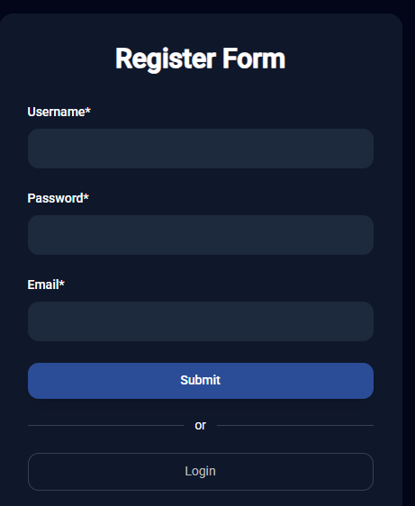

Creates a new user by introducing the following credentials into the `register-form`:
- `username`: *must be between 2 and 32 characters and has to be unique.
- `password`: *must be between 8 and 64 characters.
- `email`: *must be valid (`**@**.**`) and have a maximum of 64 characters.

Then, the `register-form.ts` manages the parameters inputed by the user and sends them to the [`auth.service`](#-31-auth-service), so the ladder can send them to the backend.

***There are three possible outcomes to this action:***
> [!CAUTION]
> Non valid credentials (either the lenght or the format of the input were not respected)

> [!CAUTION]
> Username already exists (every username has to be unique)

> [!TIP]
> User registered successfully


### - 🔑 2.1.2. Login
**Components**
- `login-form`
- `login-component`

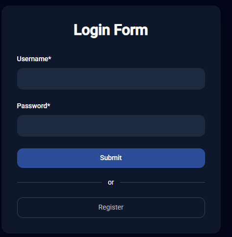

Authenticates a user by introducing the following credentials into the `login-form`:
- `username`: *already existing user's username.
- `password`: *same user's password.

... and then checking for the existance of said user (by sending the credentials to the [`auth.service`](#-31-auth-service)).

***There are three possible outcomes to this action:***
> [!CAUTION]
> User not found

> [!CAUTION]
> Username or password incorrect

> [!TIP]
> User logged in successfully

After a successfull login, the token returned by the backend gets saved in `localstorage`, which can be later used by the [`auth.interceptor`](#41-auth-interceptor) to authorize the users actions in the web.

Then, the user will be redirected to the **Platinum** `home` page, from where he can access the remaining pages.

## 👑 2.2. **Pages**
Main Platinum components.
### - 🏠 2.2.1. **Home**

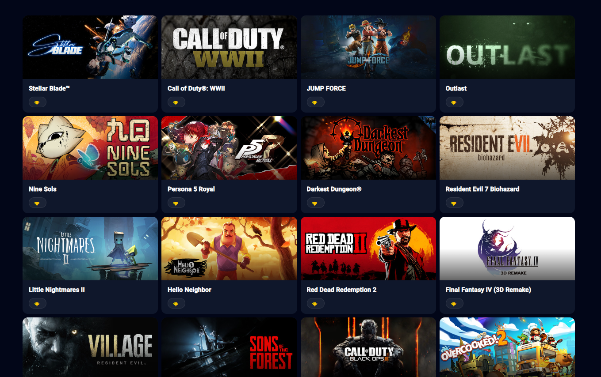

The default page when entering the web as an authenticated user.

**Components**
- `home-carousel`: displays a carousel of `game` banners.
- `home-games-list`: lists all the `game`s, utilizing an [`infinite scroll`](#️-infinite-scroll).
- `home-component`: puts together the former two components.

#### **Main functionalities:**
- Getting all the games in order to display them in the `home-games-list` component.
### - 👾 2.2.2. **Game**
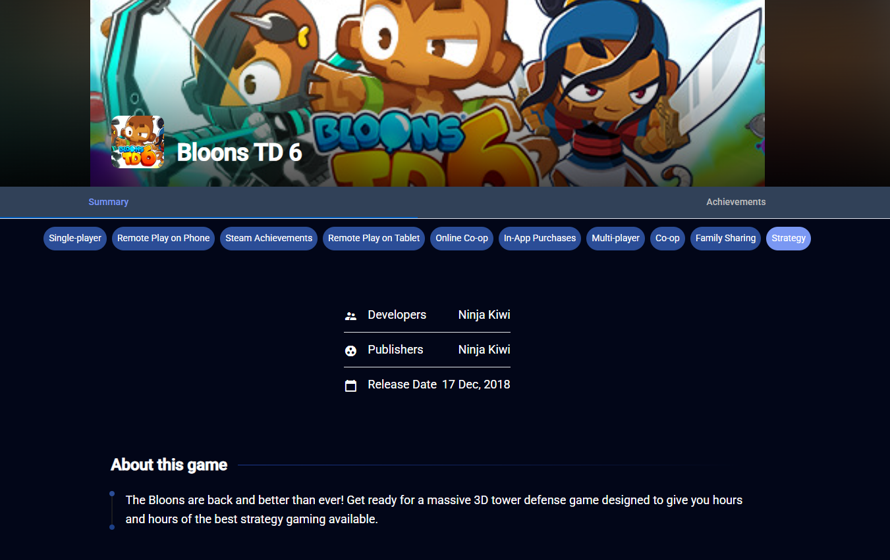

The information page displayed when clicking on a certain [`Game`](#-12-game-model) from a list of games.

**Components**
- `game-banner`: Includes basic "first-sight" information for the `game`.
- `game-tabs`: A mid-page element that allows the user to switch between the `game-summary` and `game-achievements` options.
- `game-summary`: The default tab. Displays a more detailed information page about the `game`.
- `game-achievements`: The alternate tab. It shows a card for each `achievement` the `game` has, accompanied by a short description.
- `game-component`: puts together all the former components.
> [!NOTE]
>If the user is [`linked`](#️-steam-account-linking), the component `game-achievements` additionally displays the state of the `achievement` (either "unlocked" or "not unlocked") and the icon color chaanges accordingly (gray if it isn't unlocked, colored otherwise). It will also indicate the percentage of completion of said `achievement`.
>[]
#### **Main functionalities:**
- Retrieving the detailed information of a `game`.
- Retrieving the information of the game's `achievement`s (if there are any for that game).

### - 🔎👾 2.2.3. **Games browse**

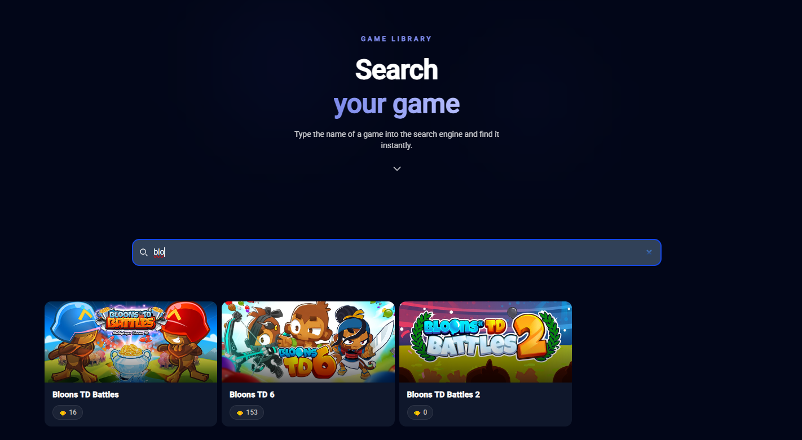

A page dedicated to display the list of games and allow the user to browse for a specific `game`.
**Components**
- `games-browse-games-list`: Similarly to the [`home-games-list`](#---221-home), it lists all the games as cards and uses the [`infinite scroll`](#️-infinite-scroll).
- `games-browse-component`: Contains the component described above.

#### **Main functionalities:**
- A [`search input`](#-search-input) to look for specific games.
- Some options to filter by `genre`, `category`...
### - 👤 2.2.4. **Account**

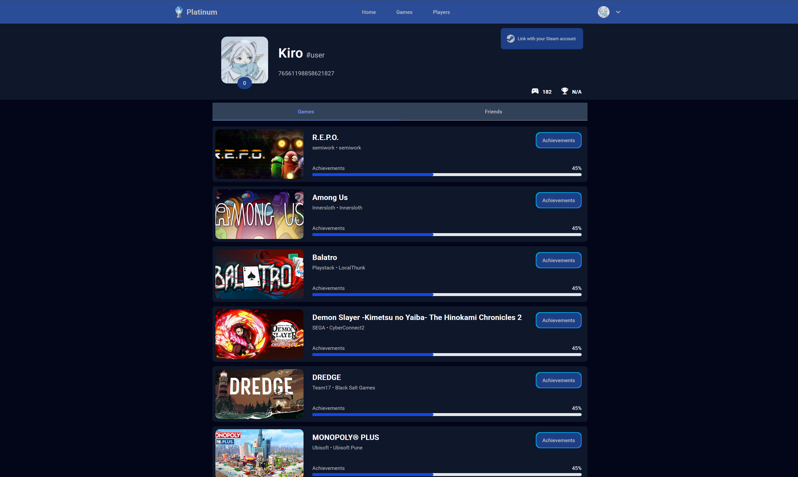

The current logged user's main profile page.

**Components**
- `account-banner`: Displays a brief summary of the user's data as well as the option to [link a Steam account](#️-steam-account-linking) to the user.
- `account-tabs`: Changes the view between the `account-games-list` and the `account-friends-list`.
- `account-games-list`: Default view of the page, displaying the user's owned games.
- `account-friends-list`: List of the user's Steam friends.
- `account-component`: Contains all the former components.
>[!WARNING]
>Many parts of this web need a SteamId (the id of a Steam account) to get the necessary data of a certain user.
>If the user has not [linked a Steam account](#️-steam-account-linking), both the `account-games-list` and the `account-friends-list` won't have any content to display. The `account-banner` won't display a profile picture nor a SteamId. 
>Fortunately, the user will be notified about this condition.
>[]


#### **Main functionalities:**
- [Link a Steam account](#️-steam-account-linking).
- Retrieve data (games, friends) from a certain user (using its SteamId as reference) if possible.
- The `game` cards also show the `achievement` progression that the user has (percentage of achievements completed in that game).

### - 🔎👤 2.2.5. **Users browse**

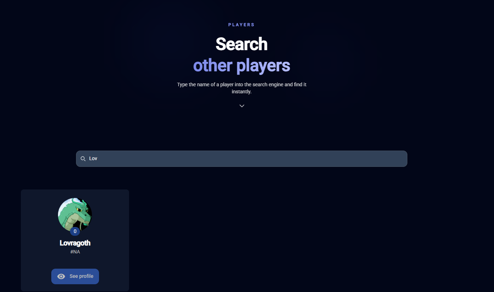

A page dedicated to display the list of users and allow the user to browse for a specific `user`.

**Components**
- `users-browse-users-list`: Similarly to the [`home-games-list`](#---221-home), it lists all the users as cards and uses the [`infinite scroll`](#️-infinite-scroll).
- `users-browse-component`: Contains the component described above.
>[!NOTE]
>When clicking on a user that lacks a Steam account, it will notify and not redirect to that users profile
> When clicking on your own user, it will redirect to the [`account`](#---224-account) page
>[]

#### **Main functionalities:**
- A [`search input`](#-search-input) to look for specific users by their username.


### - 👲 2.2.6. **Foreign user**
This page mirrors the [`account`](#---224-account) page, but without some options (like linking a Steam account).
- `foreign-user-banner`: Displays a brief summary of the user's data.
- `foreign-user-tabs`: Changes the view between the `foreign-user-games-list` and the `foreign-user-friends-list`.
- `foreign-user-games-list`: Default view of the page, displaying the user's owned games.
- `foreign-user-friends-list`: List of the user's Steam friends.
- `foreign-user-component`: Contains all the former components.

#### **Main functionalities:**
- Retrieve data (games, friends) from a certain user (using its SteamId as reference) if possible.
- The `game` cards also show the `achievement` progression that the user has (percentage of achievements completed in that game).

## 🫂 2.3. **Common**
Components used in more than one page (mainly the card variants of the data retrieved from the backend).
- `achievement-card`: contains the `achievement` information.
- `game-card`: contains the `game` information.
- `game-card-listed`: listed display version of the card.
- `user-card`: mainly used for the `foreign-user`s cards.
## ⚓ 2.4. **Layout**
The web elements that are included in every Platinum page.
### - ⛵ 2.4.1. **Navbar**


Fixed to the top of the screen, this menu includes links to:
- `home`
- `games`
- `players`
- dropdown with a link to the `account` page and a `logout` button.

*(dropdown with options)*

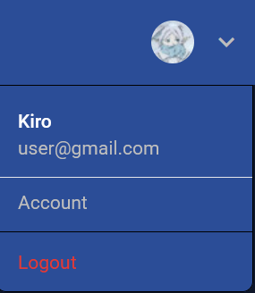

### - 👞 2.4.2. **Footer**
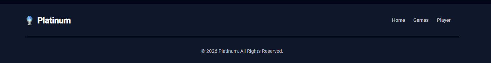

Fixed to the bottom of the screen, this menu includes links to:
- `home`
- `games`
- `players`
- and the copyright information.

# 🍂 3. Services
## 🔏 3.1. **Auth service**
The `auth.service` handles the data received from the [`Login`](#---212-login) and [`Register`](#---211-register) and sends it to the backend for further management.
### **Main functionalities:**
- `register`: complement the [`Register`](#---211-register) method of the [`Auth component`](#-21-auth-component).
- `login`: complement the [`Login`](#---212-login) method of the [`Auth component`](#-21-auth-component).
- `logout`: deletes the current session token and redirects the user to the login page, from where he cannot access any other page until he's logged back in.
- `isAdmin`: checks if the user has the role of `admin`.
- `getToken`: retrieve the `localstorage` token.
- `handleLoginSuccess`: saves the response's token in `localstorage` and creates the `User` with the parameters.
- `linkSteamAccount`: sends the `steamId` to the backend. [Go to in depth explanation](#️-steam-account-linking)

## 💻 3.2. **Game service**
The `game.service` manages the conection with the backend and the data related with the [`Game`](#-12-game-model).
### **Main functionalities:**
- `convertAppToGame`: Transfers the `App` data (Steam game) to `Game` data (Platinum game).
- `getAppList`: Retrieves a list of all the games from the backend.

## 👮 3.3. **User service**
The `user.service` manages the conection with the backend and the data related with the [`User`](#-11-user-model).
### **Main functionalities:**
- `getOwnSummary`: Obtain the summary data for the currently logged user.
- `getOwnGames`: Obtain a list of games for the currently logged user.

## 🏪 3.4. **Stores**
Using a `map` that stores data in the localstorage everytime the displayed data is changed.
### **Main functionalities:**
- Everytime a request is sent, the response data is compared to that of the store.
- It includes a `games-store` and a `users-store`.

# 🍁 4. Interceptors
## 🔓 4.1. **Auth interceptor**
### **Main functionalities:**
Every time a request is sent to the backend, this interceptor makes a copy of the request and introduces the validation token in the headers. In case there's no such token, or the request returns an error state, an error is thrown and the user is redirected to the login page.

**Main steps**

**1st - Cloning the request:** Every time a request is sent to the server, this interceptor creates an exact copy of that request.

**2nd - Obtaining the token:** Once it has the cloned copy, the interceptor uses the AuthService to obtain the users token. If that's not an option, it throws the original request.

**3rd - Insertion of the token in the headers:** With the token saved, the interceptor adds it to the headers of the cloned request, in the Authorization section.

**4th - Throwing the request:** When the ladder is done, the cloned request is sent to the server.

**5th - Checking the results:** Lastly, when we receive the request for the server, the interceptor checks the state of said request. If the state given is a code 200, then it returns the request to the client in a successfull way. On the other hand, if the request returns with a code of 401 or 403, the [`logout`](#-31-auth-service) is executed and an error is thrown, because this indicates that the token isn't correct or that it has expired.

## 💾 4.2. **Cache interceptor**
### **Main functionalities:**
The cache interceptor's main objective is to avoid the repetition of requests. This is done by checking if any request given already exist before saving them in `localstorage` and in the interceptor's `map`.

**Main steps**

**1st - Obtain header from request:** From the request given, the interceptor looks for the `authorization` field and obtains the `token` this header contains.

**2nd - Identifying the request:** By combining the `url` and the `token`, the interceptor creates a unique `key`, allowing it to identify the request.
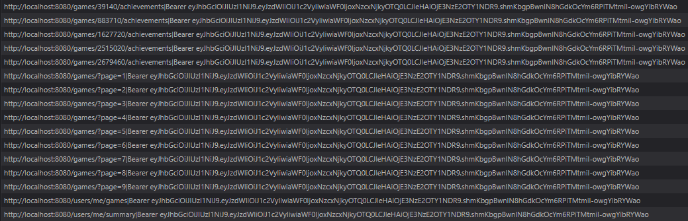

**3rd - Comparing the key with the map:** Check if the request given exists in the interceptors `map` by comparing the values of the `key`. If there are any coincidences, the process stops here.

**4th - Comparing the key with localstorage:**  Check if the request given exists in `localstorage`, also by comparing the `key` values. If there are any coincidences, the process not only stops, but also the `key` gets saved in the interceptor's `map` as well.

**5th - Inflight map:** Before finally sending the request, the `key` also gets saved in another `map` called `inflight`, which prevents the following scenario: 

"*a user clicking multiple times on a `game`. Because that request isn't saved yet neither in the `map` nor in `localstorage`, the logic allows multiple requests to be sent, probably causing conflicts.*"

The way `inflight` avoids this problem is by saving the request's `key` before it can get stored in other places. Then, like the rest, compares the saved `key` to the one of the request and declines further requests with matching `key`s.

**6th - Send the request and handle response:** Sends the request to the backend and stores the response in the `map` and `localstorage`. Then, it also deletes the `key` saved in the `inflight` and returns to the client a copy of the request.

**EXTRA - TimeToLeave(TTL):** Every stored request has an attribute called `TimeToLeave` (set to 30min). When the 30 minutes have passed, the interceptor treats this atribute as a green light to send a request with the same `key` (even though it still exists).

# 🌵 5. Guards
## ✋ 5.1. Auth Guard
### **Main functionalities:**
The auth guard's objective is to prevent unauthenticated users from reaching protected pages by introducing the corresponding url.

When a non-authenticated user tries to access the `account` page (for example) via typing the url, the guard will check wether this user is authenticated and if `false`, it will redirect him to the login page.

*(list of routes allowed)*

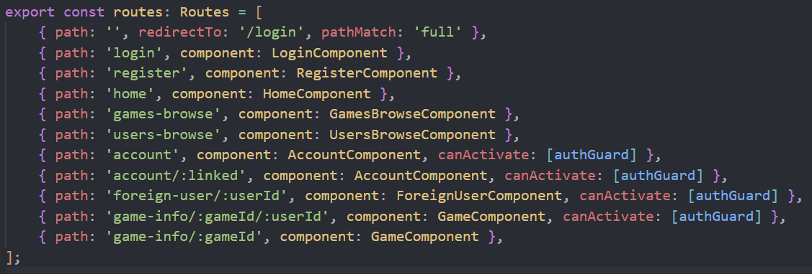


# 🌴 *EXTRA* Additional features 
## ♾️ Infinite scroll
### ***Applied to***
- [`home-games-list`](#---221-home)
- [`games-browse-games-list`](#---223-games-browse)
- [`users-browse-component`](#---225-users-browse)
### **EXPLANATION**
**1 - Page request:** A request to the backend is sent with the next `page number`. It returns the list of games from that specific page (20 games for page).

**2 - Handling the response:** When the response arrives, the `page number` gets saved in the [`games-store`](#---341-games-store) inside a `set` (an array with only one element) and every individual `game` in the component `map`.

**3 - Saving the list:** The games received get saved in the component list.

**4 - Checking for more pages:** The backend has two values:
- the current `page number`.
- the total number of pages.
With this information, the application checks if there are any more pages remaining to load. If there are, the next request proceeds. If there are not, it will stop requesting.

> [!NOTE]
> When reloading the page, usually the request will start from the page 1 (even though more pages loaded). To avoid this, all the previously loaded pages get stored in localstorage by the `set` and the method `loadLastPage` will return the necessary data.

> [!NOTE]
> In order to detect wether the end of the page has been reached or not, a "div" element, positioned at the bottom of the screen, will indicate that the bottom has been reached when it is displayed.


## ⛓️ Steam Account Linking
### ***Executed in***
- [`account-banner`](#---224-account)
### ***Applied to***
- [`account`](#---224-account)
- [`game-achievements`](#---222-game)
### **EXPLANATION**
When clicking on the following button found on the [`account-banner`](#---224-account) component...

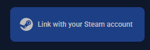

it will redirect the user to the Official Steam Login web page

<details>
<summary>Redirect URL</summary>

```typescript
'https://steamcommunity.com/openid/login?'
'openid.ns=http://specs.openid.net/auth/2.0&'
'openid.mode=checkid_setup&' 
'openid.return_to=http://localhost:4200/account&' // Component to return to after the login 
'openid.realm=http://localhost:4200&' 
'openid.identity=http://specs.openid.net/auth/2.0/identifier_select&' 
'openid.claimed_id=http://specs.openid.net/auth/2.0/identifier_select'
```
</details>
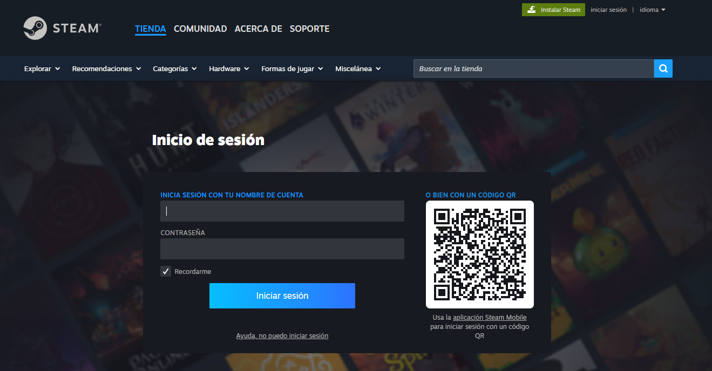

Just after logging in, it will redirect the user back to the [`account-banner`](#---224-account) page, but now the `steamId` of the user can be found in the url after the attribute `openid.claimed_id`.

The `getSteamId()` method will recover the value of the `steamId` from the url and save it as an attribute. 

Then, this attribute will be retrieved and passed as a parameter to the method in the [`auth.service`](#-31-auth-service) that sends the id to the backend (`linkSteamAccount`).


## 🔍 Search input
### ***Applied to***
- [`games-browse-component`](#---223-games-browse)
- [`users-browse-component`](#---225-users-browse)
### **EXPLANATION**
The search input works by only displaying elements where some part of their name matches the inputed text.


For example, in the image seen above, the search input is "blo", so the only games displayed are games where their names start with "blo...".

> [!NOTE]
> There is a different between the `games-browse` and the `users-browse`, as the former gets the data from the stores and the ladder from the backend directly